# Nyra Research Cortex

## Outcome

Nyra can use current web evidence when an authenticated ChatGPT or Codex client
is connected to the SkinHarmony MCP. Universal Core plans and validates the
research; the connected AI host performs the primary web search; the MCP stores
only short, sanitized evidence inside the authenticated tenant.

This is governed retrieval learning, not autonomous model-weight training.
Unreviewed web content never becomes a global rule or shared tenant knowledge.

## Primary flow

```mermaid
flowchart LR
  AI["ChatGPT or Codex"] --> PREFLIGHT["work_preflight"]
  PREFLIGHT --> PLAN["nyra_research_plan"]
  PLAN --> WEB["Host-managed web search"]
  WEB --> INGEST["nyra_research_ingest"]
  INGEST --> CORE["Core claim-evidence validation"]
  CORE --> CANDIDATE["Tenant candidate or quarantine"]
  CANDIDATE --> REVIEW["nyra_research_feedback"]
  REVIEW --> VALIDATED["Validated tenant evidence"]
  VALIDATED --> MEMORY["Tenant Memory Fabric and search/fetch"]
```



The host-managed route is first because it does not require Nyra to receive a
ChatGPT or Codex secret. A consumer ChatGPT subscription is not a server API
credential; the host can browse during the connected conversation, while the
MCP receives only the resulting bounded evidence pack.

## MCP tools

| Tool | Scope | Effect |
|---|---|---|
| `nyra_research_plan` | `core:read` | Returns risk, freshness, domains, source requirements and Nyra/Core routing. It does not browse. |
| `nyra_research_ingest` | `core:govern` | Validates and atomically stores an idempotent tenant candidate or quarantine record. |
| `nyra_research_query` | `core:read` | Searches candidate and validated evidence in the authenticated tenant. Quarantine is metadata-only and requires govern scope. |
| `nyra_research_status` | `core:read` | Reports counts, providers and learning policy without credentials. |
| `nyra_research_feedback` | `core:govern` | Confirms, challenges or deprecates evidence after a Core gate. |
| `search` / `fetch` | `core:read` | Exposes only validated research through the ChatGPT company-knowledge contract. |
| `nyra_research_execute` | `core:govern` | Optional billable OpenAI fallback. Hidden unless configured and enabled. |

Ingest requires a Core `plan_id` issued to the authenticated tenant during the
previous 24 hours, the exact source policy returned with that plan, and an
idempotency key. A fabricated, expired, cross-tenant or weakened plan is
rejected. Allowed domains and freshness are enforced again during validation.
The same idempotency key with a different payload is rejected.

## Evidence lifecycle

- `candidate`: sanitized and Core-validated, but not yet approved as knowledge;
- `quarantined`: prompt injection, sensitive data, unsupported facts or another
  release condition requires review; content is not returned by normal query;
- `validated`: an authorized tenant reviewer confirmed eligible evidence;
- `deprecated`: explicitly retired evidence. Expired evidence is purged by retention.

Retention is the smaller of `RESEARCH_RETENTION_DAYS` and the plan freshness
window. Promotion to tenant memory uses the same bound. There is no automatic
cross-tenant or global promotion.

## Security boundary

- tenant identity comes only from verified OAuth or the configured Codex bearer;
- each tenant uses a separate directory and server-side Core key;
- secrets, JWT-like values, key assignments and unsafe control characters are rejected;
- emails and phone numbers are redacted before persistence;
- HTTP, credentials in URLs, non-public/single-label hosts, raw IP hosts and reserved local domains are rejected;
- source instructions are treated as untrusted data; prompt injection is detected in English and Italian;
- source HTML is stripped and full pages are never stored;
- Core audit records IDs, counts and decisions, not source bodies or credentials;
- writes and optional external calls fail closed unless Core explicitly allows them.

## Optional OpenAI fallback

Production defaults:

```text
RESEARCH_CORTEX_ROOT=/var/data/skinharmony-core-mcp
RESEARCH_RETENTION_DAYS=365
NYRA_OPENAI_RESEARCH_ENABLED=false
NYRA_OPENAI_RESEARCH_MODEL=gpt-5.6
NYRA_OPENAI_RESEARCH_TIMEOUT_MS=90000
NYRA_OPENAI_RESEARCH_MAX_CALLS_PER_HOUR=10
OPENAI_API_KEY=<Render secret, never sent to clients>
```

The existing key may be configured while the feature remains disabled. Enabling
it requires a deployment configuration change. Every call then needs
`core:govern`, mandatory preflight, an explicit Core gate classified as a
billable external read, and the per-tenant hourly limit. The Responses API result
is requested with `store:false`, is limited to three web tool calls, and is
returned as an evidence template without automatic local persistence.

## Cost model

- Primary host browsing adds no OpenAI API call to the SkinHarmony backend. Host
  product plan and usage limits still apply to the ChatGPT or Codex user.
- The feature reuses the existing Core, MCP and Nyra Render services; no new
  service is required. Evidence uses the existing persistent storage allocation.
- OpenAI API cost exists only when the optional fallback is enabled and invoked.
  Usage tokens are returned in the tool response for budget reporting.

## Operations and limits

Nyra readiness probes the public MCP health endpoint through
`NYRA_RESEARCH_MCP_URL` and reports only booleans and version data. It never reads
the MCP provider key. The file-backed research store supports concurrent requests
inside one MCP instance. Horizontal multi-instance scaling requires a shared
transactional database while preserving the same tenant and lifecycle contract.

Verification:

```bash
npm test --prefix services/skinharmony-core-mcp
npm test --prefix services/universal-core-service
npm run nyra:runtime:test
node --experimental-strip-types universal-core/tests/nyra-research-overlay-test.ts
```
