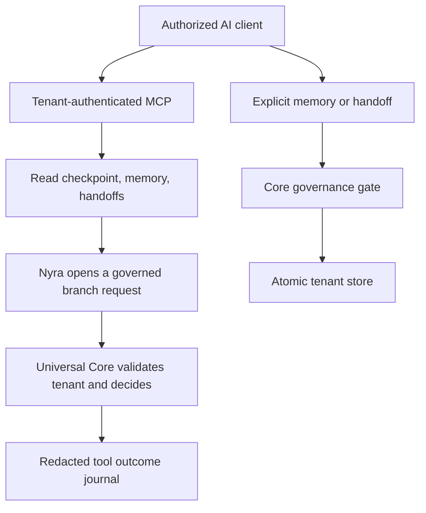

# Tenant Memory Fabric v1

## Outcome

Nyra, Universal Core and any authorized AI client can resume the same tenant's
work from server-side memory. The memory is shared between agents but never
between customers. Nyra reads it before runtime context or interpretation;
Universal Core validates the tenant again and accounts for relevant memories and
pending handoffs when evaluating the request.

## Runtime flow



## Durable records

| Record | Purpose | Creation |
|---|---|---|
| Journal event | Safe operational trace of MCP tool completion/failure | Automatic, metadata only |
| Memory | Facts, decisions, actions, outcomes and next steps | Explicit, Core-governed |
| Checkpoint | Stable restart point for another AI/session | Explicit, Core-governed |
| Handoff | Directed pending work for one AI or all tenant AIs | Explicit, Core-governed |

The v1 file driver stores one atomic state file below
`MEMORY_FABRIC_ROOT/tenants/<tenant_id>/memory-fabric/state.json`. A lock file
serializes concurrent writers and every successful transaction increments the
revision. State is pruned by expiration and bounded collection sizes.

## MCP contract

- `memory_context`: latest checkpoint, relevant memories, pending handoffs and recent activity.
- `memory_search`: tenant-only lexical/recency/importance search.
- `memory_append`: append an explicit observation, decision, action, outcome or learning.
- `memory_checkpoint`: persist a resumable work state.
- `memory_handoff`: assign durable context to one agent or all agents.
- `memory_handoff_acknowledge`: atomically acknowledge a matching handoff.

Read tools use `core:read`; writes use `core:govern`. Tool input never accepts a
tenant identifier. The tenant comes only from the verified OAuth/bearer identity.

## Privacy and security

- filesystem paths use validated tenant identifiers and remain below the tenant root;
- records classified `restricted` are rejected;
- `customer_personal` requires `consent_reference` and is capped by personal retention;
- bearer tokens, OpenAI/SkinHarmony keys, JWT-like values, password/token assignments,
  long hexadecimal secrets and email addresses are redacted before persistence;
- automatic journaling does not copy prompts, messages, arguments or full results;
- Universal Core rejects a memory context whose `tenant_id` differs from the authenticated tenant;
- public memory responses omit actor subjects and idempotency keys.

## Deployment

Required for production:

```text
MEMORY_FABRIC_ROOT=/var/data/skinharmony-core-mcp
MEMORY_RETENTION_DAYS=365
MEMORY_PERSONAL_RETENTION_DAYS=90
```

The root must be on persistent server storage. The file driver is valid for one
MCP service instance with concurrent requests. Before horizontally scaling the
MCP across multiple independent instances, replace the file driver with a shared
transactional database while preserving this tenant-scoped contract.

## Verification matrix

The automated suites cover:

- tenant A/B isolation and cross-tenant context rejection;
- secret/email redaction before disk writes;
- restricted/personal classification and consent enforcement;
- explicit write Core denial;
- idempotent append and persistence across fabric reinitialization;
- checkpoints, directed handoffs, recipient validation and acknowledgement;
- forty concurrent writes without lost updates;
- search relevance and scope filters;
- automatic journal minimization;
- Nyra-to-Core memory injection with execution remaining disabled;
- regression of MCP OAuth/scopes, workspace collaboration, domain packs and the
  twenty-subbranch Nyra limit.
