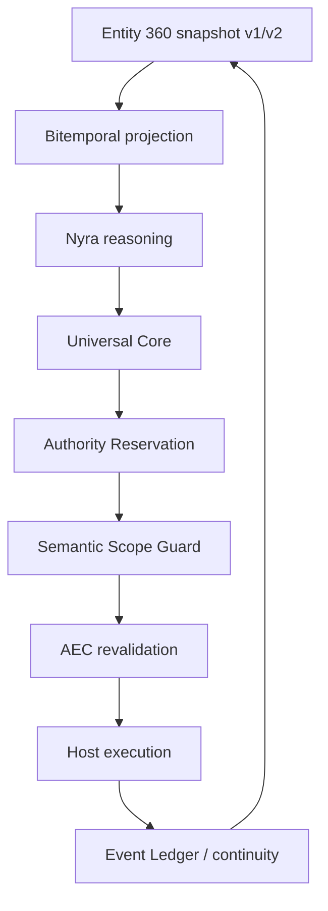

# ADR — Entity 360 bitemporal context e Continuous Semantic Scope Guard v1

## Stato e decisione

Questo ADR estende i componenti esistenti, non ne crea di paralleli:

- `entity360.js` rimane il contratto di snapshot/context/evidence;
- `entity360Runtime.js` rimane il Context Assembler e il punto di lettura;
- `hostNativeGovernance.js` rimane Universal Core / Authority Reservation /
  Authorization-to-Effect Closure (AEC).

La decisione è introdurre `entity_360_snapshot_v2` opzionale in `SHADOW` e
una proiezione immutabile `entity_360_bitemporal_snapshot_v1`; il Semantic
Scope Guard è un segnale deterministico collegato ai ticket AEC, mai una
nuova fonte di authority.

## Mappa architetturale

`agent_id` è correlazione operativa; `work_id` e relativa history restano la
continuità. La sostituzione dell’agente non modifica la Work Identity.

## Semantica temporale

`valid_*` descrive il tempo nel mondo rappresentato; `known_*` il tempo in
cui Core possedeva il fatto. Un fatto valido il 10 agosto ma noto il 12 non è
ammissibile in un replay della decisione dell’11.

La proiezione conserva, senza rendere eseguibile il contenuto:

- `valid_from`, `valid_to`, `known_from`, `known_to`;
- source/provenance/evidence, observed/recorded time, confidence e
  corroboration;
- supersession e stato `CURRENT`, `HISTORICAL`, `SUPERSEDED`, `STALE`,
  `CONFLICTING` o `EXPIRED`;
- digest deterministici di snapshot, source set ed evidence set.

Le modalità di query estendono le read E360 esistenti: `CURRENT_STATE`,
`VALID_AT`, `KNOWN_AT`, `VALID_AND_KNOWN_AT` e `DECISION_CONTEXT_AT`.
`replayEntity360DecisionContext` seleziona esclusivamente snapshot a
knowledge time verificato non successivo alla decisione e restituisce `HOLD`
quando non esiste quel cut o manca evidence/policy richiesta.

## Compatibilità e migrazione

La persistenza E360 è già append-only e versionata; non è richiesta una
migrazione distruttiva o una colonna relazionale aggiuntiva. Il cutover è:

1. scrivere v2 soltanto quando `CORE_ENTITY360_BITEMPORAL_MODE=SHADOW`;
2. mantenere lettura/verifica v1 e v2;
3. trattare v1 come `knowledge_time_quality=UNKNOWN`, senza inventare
   `known_from`;
4. fare backfill soltanto quando la provenance prova il knowledge time,
   marcando il livello `VERIFIED`/`INFERRED` esplicitamente;
5. disabilitare il flag per rollback: v1 continua ad essere leggibile e non
   viene cancellato alcun record.

## Semantic Scope Guard

Il contratto `semantic_scope_check_v1` confronta strutturalmente capability,
effect, target, tool, argomenti (solo digest), data/write scope, tenant, Work,
intent, policy, agent revision e snapshot E360. Il risultato è
`ALLOW|BLOCK|REDACT|HOLD|REVALIDATE`, contiene reason codes/digest e dichiara
sempre `execution_authorized=false`.

L’implementazione usa policy/insiemi/schema; non usa un LLM come barriera per
secret o PII. Cross-tenant expansion, secret egress, command-effect mismatch,
prompt escalation e scope expansion sono blocchi deterministici. Ambiguità o
staleness ad alto rischio diventano `HOLD`.

Nel percorso host-native il Guard è invocato alla emissione del ticket e alla
reservation (commit-time revalidation). Il ticket firmato e il lifecycle
record correlano i rispettivi decision digest. In `SHADOW` il segnale non
altera il comportamento; `ENFORCE` è disponibile solo come configurazione
esplicita e nega `BLOCK`/`HOLD`. Universal Core continua a essere l’unica
autorità finale.

Il binding E360 del Guard è ottenuto soltanto dal
`semanticScopeContextResolver` server-side: snapshot ref, valid/knowledge
cut, policy ed evidence non sono parametri auto-certificabili dell’azione. In
assenza o errore del contesto, il segnale diventa `HOLD`; in `SHADOW` resta
osservabile, in `ENFORCE` chiude l’effetto.

## Invarianti

- Capability, relevance, confidence e provenance non sono authority.
- Entity360, Nyra e Semantic Scope Guard non autorizzano execution.
- Capability passport equivalente e effect ceiling sono input derivati
  server-side dalla delegation; non sono auto-certificabili dal client.
- Il tenant è derivato dal percorso autenticato/DTT; il client non può
  allargarlo attraverso gli argomenti.

## Osservabilità

E360 espone `bitemporal_query_latency`, `snapshot_reconstruction_latency`,
`historical_replay_latency` e `hindsight_leakage_prevented` nello schema
metriche esistente. Host Native espone `semanticScopeMetrics()` con
`semantic_scope_check_latency`, block/hold/redact totals, drift total e gli
indicatori di false hold/block da alimentare con outcome verificati.
