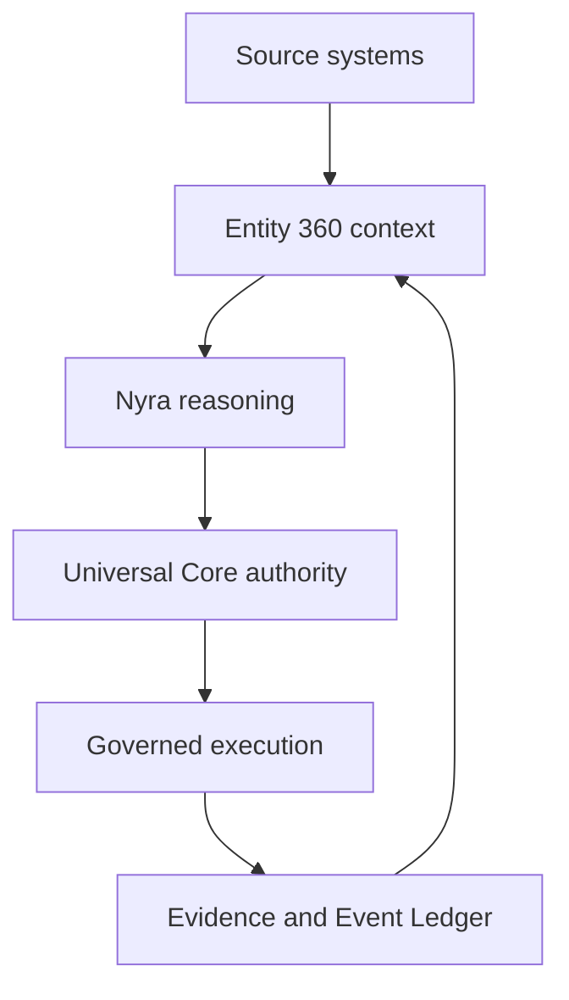

# Entity 360 context model v1

## Stato e Work canonico

Questa specifica descrive la candidata collegata al Work canonico `Entità 360`,
Work Identity `91e82640-9edc-5424-a3e8-eb7853b0d8dd`.

Il codice locale non costituisce evidenza di commit, merge, deploy o
attivazione live. V1 accetta esclusivamente `OFF` e `SHADOW`; non contiene un
percorso di enforcement.

## Ruolo architetturale

Entity 360 è un context/evidence layer general-purpose, temporale,
verificabile, domain-neutral e multi-tenant posto prima del reasoning di Nyra.
Non sostituisce Genesis, Intent, ICF, NSCT, Architecture Map, Impact Map, Event
Ledger, Work Continuity, Shared Memory, Security Intelligence o Universal Core.
I sistemi owner mantengono dati e semantiche autoritative; Entity 360 conserva
una proiezione qualificata, riferimenti e digest.



| Layer | Responsabilità | Boundary |
| --- | --- | --- |
| Context | resolution, discovery, occupancy, time, provenance, corroboration, completeness, snapshot | nessuna authority o execution |
| Reasoning | analysis, impact, preliminary proposal | non inventa missing context |
| Authority | verifica indipendente e decisione finale | non delega la decisione a provenance/confidence |
| Execution | mutazione separatamente autorizzata e bounded | non usa snapshot/receipt come ticket |
| Evidence | eventi, outcome e riferimenti per snapshot successivi | non riscrive history |

## Pipeline

1. compilazione di policy e ontology versionate;
2. Entity Resolution deterministica e tenant-bound;
3. Source Discovery server-side nello stesso consistent cut;
4. normalizzazione ed evidence/source-specific digest verification;
5. Bounded Source Occupancy;
6. Temporal Reconciliation;
7. provenance/trust evaluation e Cross-Source Corroboration;
8. conflict e Context Completeness Evaluation;
9. qualification attestation, snapshot immutabile e persistenza CAS;
10. Nyra reasoning, impact e preliminary proposal;
11. Universal Core independent authority verification;
12. confronto shadow con il current path senza modificarlo;
13. eventuale execution separatamente governata;
14. Evidence/Event Ledger e nuova versione dello snapshot.

L'assembly non accetta contribution, evidence, confidence, completeness,
authority o snapshot version dal caller. `assembleContext` apre una sola
transazione PostgreSQL `REPEATABLE READ READ ONLY`; resolution e tutte le query
applicabili sono tenant-bound e `as_of`-bounded. Un result dell'adapter con
resolution o linkage diverso dalla derivazione runtime viene rifiutato.

## Contratti versionati

| Contratto | Versione |
| --- | --- |
| Snapshot | `entity_360_snapshot_v1` |
| Ontology | `entity_360_ontology_v1` |
| Policy | `entity_360_context_policy_v1` |
| Kernel | `entity_360_kernel_v1` |
| Canonical JSON | `entity_360_canonical_json_v1` |
| Qualification manifest | `entity_360_qualification_manifest_v1` |
| Qualification attestation | `entity_360_qualification_attestation_v2` |
| Adapter registry | `entity_360_adapter_registry_v1` |
| Runtime | `entity_360_runtime_v1` |
| Digest | SHA-256 |

Registry definitions are tenant-scoped, versioned and append-only. Historical
verify loads the exact policy/ontology version, validates payload digests and
requires the exact `policy_digest`/`ontology_digest` bound by the snapshot.

## Ontology/Context Model

The ontology declares entity types, projections, relationship/state/transition
types, dependencies, policy bindings, evidence/source classes, trust boundaries
and temporal semantics. The extension contract is
`declarative_registry_adapter`, with additive compatibility and no vertical
hardcoding in the kernel.

V1 registers:

- `work` -> `work_360`;
- `software_component` -> `software_component_360`.

Agent 360, Customer 360, Case 360, Order 360, Machine/Asset 360 and future
verticals are ontology + adapter additions while the kernel contract remains
compatible.

## Entity resolver, Work Identity e namespace project

The deterministic ID is:

```text
e360_<first 48 hex chars of sha256(canonical tenant/type/identity scope)>
```

Identity values are normalized and keys canonicalized. A supplied `entity_id`
must match the derivation. A foreign-tenant candidate is rejected. Multiple
matches produce `AMBIGUOUS`, no selected ID and `HOLD`; no match with
`require_existing=true` produces `UNRESOLVED` and
`INSUFFICIENT_CONTEXT`/`HOLD`. Neither result writes a snapshot.

Tenant Work Gallery is the only owner of the persistent canonical Work
Identity. Resolution accepts the canonical Work UUID or its exact registered
legacy Work UUID. A Work Continuity row by itself cannot bootstrap a candidate.

Every MCP call carries a top-level canonical-format UUID `work_id`; optional
`identity.work_id` and `project_work_linkage.work_id` must equal it. MCP issues a
DTT context for the exact UUID and Universal Core verifies the same tenant,
Work and principal. After Gallery resolution the runtime accepts that UUID only
if it is the canonical `work_id` or the exact `legacy_work_id`. Snapshot reads
are bound the same way. Free-form aliases and semantic matches are forbidden.

Project identifiers have two non-interchangeable namespaces:

| Namespace | Sources | Check |
| --- | --- | --- |
| logical project slug | Tenant Work Gallery `project_id`, Work Continuity `project_id` | slug-to-slug equality |
| causal project UUID | Work Continuity `project_uuid`, causal binding/Genesis/Intent project UUID | UUID-to-UUID equality and graph integrity |

Slug disagreement emits `WORK_PROJECT_LINKAGE_CONFLICT`, nulls the logical
project linkage and makes `work.identity` conflicting. UUID disagreement emits
`WORK_PROJECT_UUID_BINDING_MISMATCH` and withholds causal authority. A slug is
never parsed or compared as a UUID.

## Adapter contracts and digest verification

Every source contract binds adapter allowlist, `allowed_fact_prefixes`, source
and trust classes, independence group, authoritative/derived state,
validity/revocation and optional blocking conflict prefixes. Contract or
validity failure is data rejection, not a fallback.

| Source | Verification before contribution |
| --- | --- |
| Tenant Work / Work Continuity | canonical Gallery identity; bounded selected-record digest; independent current-state timestamps; slug namespace consistency |
| Intent anchor | exact `intent_anchor_v1` payload digest, Gallery anchor binding and logical project slug |
| Genesis / Intent revision | causal graph joins, VERIFIED legacy binding, APPROVED Intent revision, source-domain `causalDigest` recomputation and exact append-only `WORK_OPENED/work_bind_intent` event/hash-chain binding |
| ICF | only `nyra.icf.event-digest/canonical-json-v2`: recursive key-sorted JSON, array order preserved, payload digest plus event-envelope digest recomputed; sequence equals Work version and event digest equals `ledger_head_digest`; no synthetic fallback |
| Architecture Map | recomputed digest of the bounded architecture payload |
| Impact Map | derived digest bound to the verified architecture version; remains analysis/derived evidence |
| Event Ledger | recomputed tenant/legacy-Work/sequence/event/payload/previous-hash digest |
| Security Intelligence | `projectScopeObservationDigest`, evidence digest, tenant/Work binding, canonical independent-observer admission/provenance, confidence and source-provided freshness boundary; `EXECUTOR` self-reports are quarantined |
| NSCT | owner-keyring signature, row/payload/request digests and complete per-plan chain verified at `as_of`; owner-side count/byte gate; minimized advisory head set with no silent plan selection |
| Software/Component Atlas | `verification_state=verified`, revision-history record at `as_of`, exact node digest and serialized context-byte binding |

Malformed proof emits source-specific codes such as
`ICF_EVENT_DIGEST_MISMATCH`,
`ICF_EVENT_DIGEST_CONTRACT_LEGACY_REANCHOR_REQUIRED`,
`ICF_EVENT_DIGEST_CONTRACT_UNSUPPORTED`, `ARCHITECTURE_DIGEST_MISMATCH`,
`EVENT_LEDGER_DIGEST_MISMATCH`, `CAUSAL_BINDING_EVENT_MISMATCH`,
`SECURITY_OBSERVATION_DIGEST_MISMATCH`, `SECURITY_OBSERVATION_ADMISSION_REJECTED` or
`COMPONENT_REVISION_HISTORY_MISSING_AS_OF`; it never creates replacement
evidence.

Optional queries run under a savepoint in the common read-only transaction.
Only PostgreSQL table/column missing (`42P01`/`42703`) becomes
`SOURCE_SCHEMA_UNAVAILABLE`; every other DB error rolls back the transaction.

NSCT is wired through `nsct_entity360_adapter_v1` as derived advisory context: the
owner store verifies the complete receipt chain and signatures at the bounded
`as_of` cut, looks up the resolved legacy Work UUID, preserves the canonical
Gallery entity identity, and emits only a minimized set of plan-head
references/digests, disposition, next step, freshness and binding digest. More
than one plan head is an explicit non-selecting conflict. Historical receipt
verification uses a bounded verify-only Ed25519 retained keyring with exact
`key_id` dispatch; it never falls back to another key and is separate from the
active signing capability. Shared Memory and
runtime state remain declared but not wired and report `ADAPTER_NOT_WIRED_V1`.
Universal Core reports
`AUTHORITY_SELF_CORROBORATION_EXCLUDED_V1` and cannot corroborate itself.

## Bounded Source Occupancy

Policy, not code constants or universal percentages, controls:

- source/entity/evidence count;
- relationship depth;
- retrieval bytes and context/token volume;
- contribution/evidence/byte/token budgets per source;
- the same budgets per source class and trust class.

Claims are canonically ordered and deduplicated. Required-context membership is
the admission priority; an advisory source cannot self-declare criticality to
displace mandatory governance facts. Decisions are `accepted`, `limited` or
`rejected` with exact reason codes and bounded occupancy measurements.

The PostgreSQL adapter also enforces the remaining raw-retrieval budget before
any source row crosses into Node. Counters are aggregate and simultaneous at
global, source, source-class and trust-class scope; a second source cannot reuse
capacity already consumed by another source in the same class. Bounded queries
first use `pg_column_size` as a storage-size pre-gate, serialize only rows that
fit that gate, then enforce the exact encoded JSON byte total. Any overflow
quarantines the whole source contribution as
`SOURCE_RETRIEVAL_BUDGET_EXCEEDED`, including bounded retrieved/attempted-byte
measurements. This is an egress and assembly control, not a substitute for
owner-side indexes, bounded projections and database resource limits.

The persisted qualification manifest contains source/adapter/trust bindings,
fact and evidence digests/refs, admission decisions and rejections. It omits
`fact.value`, particularly for limited/rejected material, which mitigates
memory/retrieval poisoning and context flooding without duplicating raw owner
data.

## Temporal reconciliation and supersession

Each claim includes `observed_at`, `recorded_at`, validity interval, declared
state, optional `supersedes_claim_id` and tombstone. At snapshot `as_of`, the
kernel separates:

- `current_state`;
- `historical_state_references`;
- `superseded_state_references`;
- `stale_state_references`;
- contradictions/conflicts.

Canonical RFC3339 timestamps and bounded clock skew are enforced. Creation may
follow historical `as_of` within a reconstructable snapshot; the verifier uses
the actual temporal relation, not timestamp equality. Supersession must be
same-fact and trust-valid; unknown targets, cycles, cross-fact low-trust links
and concurrent current values remain machine-readable blocking contradictions.
ICF head facts use the verified event `created_at` as both observation and
recording time; snapshot `as_of` can never refresh an old head. Mutable
`core_icf_work.state` is deliberately excluded until an event digest contract
binds that state.

Source retention bounds reconstruction. If a mutable owner no longer retains
an old row, the result is missing context, not a fabricated history.

## Corroboration and completeness

Corroboration counts independent non-derived lineage groups. Policy may require
multiple independent sources or one verified authoritative source for the
specific fact prefix. For high-impact context, policy explicitly lists eligible
trust classes and cannot include `advisory`; observed but ineligible sources and
authoritative claims are reported separately. Every high-impact requirement is
mandatory by compile-time invariant. Provenance and confidence never substitute
for these rules.

The evaluator returns:

```text
completeness
confidence
missing_context[]
stale_sources[]
contradictions[]
corroboration_gaps[]
authoritative_sources_missing[]
```

| Context status | Admissible Core review envelope |
| --- | --- |
| `AMBIGUOUS` | `HOLD` |
| `CONFLICTED` | `HOLD` |
| `INCOMPLETE` | `INSUFFICIENT_CONTEXT`, `HOLD` |
| `READY` | `ALLOW`, `HOLD`, `BLOCK` |

This is a context envelope, not a verdict. Completeness/confidence are signals,
not authorization.

## Snapshot and qualification attestation

The domain-neutral snapshot includes identity/scope, project/Work linkage,
current/historical/superseded/stale state, relationships/dependencies,
architecture/runtime/concurrent Work/agent-provider placeholders, provenance,
evidence refs/digests, Genesis/Intent/ICF/policy bindings, security signals,
contradictions, freshness, completeness, confidence, missing context, source
diversity, corroboration, versions, `as_of`, `created_at`, semantic digest and
envelope digest.

V1 rejects unqualified executable sections and unknown root/nested fields. The
semantic digest excludes wall-clock creation and assembly latency; the envelope
digest binds semantic digest, `created_at` and schema. Snapshot version 1 has a
null predecessor and later versions bind the exact previous semantic digest.

At assembly, Universal Core signs a qualification payload with the host-native
HMAC-SHA-256 domain sourced from `CORE_HOST_NATIVE_SIGNING_SECRET`, purpose
`entity360-qualified-context-v1`. It binds tenant, entity/type/identity,
snapshot version/chain/time, policy and ontology, adapter registry,
`postgres_repeatable_read` cut, manifest/source discovery, project/Work linkage
and semantic digest.
`entity_360_qualification_attestation_v2` additionally binds the exact active
`key_id`; historical verification resolves only that id from a bounded
verify-only retained keyring. Rotation never rewrites an immutable snapshot.

The store gets only a verifier object and rejects one that exposes `sign`.
Before write/read verification it checks the attestation, exact schemas,
authority boundary, deterministic derivations and semantic/envelope digests
using trusted database persistence time.

This verifier is not evidence-independent: it does not re-query every owner
source or reconstruct omitted raw facts. The keyed proof binds the compact
snapshot to the trusted assembly cut. It is neither truth nor authority and
cannot authorize execution.

## Persistence and concurrency

Migration `20260825_001_entity360_v1` creates registry, feature flag, entity
head, snapshot, shadow receipt, idempotency, backfill checkpoint and backfill
event tables. Definitions, snapshots, receipts, idempotency and backfill events
are append-only with `UPDATE`/`DELETE`/`TRUNCATE` guards. Tenant/entity composite
keys prevent cross-scope links. Heads and flags use revision CAS; one concurrent
writer can win.

Idempotency is tenant/operation/key and canonical-request bound. Replay lookup
occurs before definitions, resolution and adapter access, and returns the exact
persisted version/envelope. Backfill is checkpointed, additive and
non-destructive; v1 does not expose a public backfill orchestrator.

The migration verifier derives an exact catalog manifest from a
transaction-local reference schema and compares column, constraint, local FK
namespace, index, trigger and local trigger-function semantics. The public
verifier accepts only `COMPLETED`/`READBACK_VERIFIED`; `APPLYING`, `FAILED`, a
wrong checkpoint or catalog drift makes Store health fail closed.

## Core routes, MCP tools and errors

Universal Core registers nine routes:

| Capability | Access | MCP |
| --- | --- | --- |
| `entity_360_resolve` | DTT read | yes |
| `entity_360_snapshot_assemble` | DTT write | yes |
| `entity_360_snapshot_latest` | DTT read | yes |
| `entity_360_snapshot_read` | DTT read | yes |
| `entity_360_snapshot_verify` | DTT read | yes |
| `entity_360_shadow_compare` | DTT write, diagnostic | yes |
| `entity_360_policy_read` | DTT read | yes |
| `entity_360_metrics_read` | DTT read | yes |
| `entity_360_feature_flag_write` | Core operator configure | no |

MCP schemas are tenant-free and `additionalProperties:false`. The bridge strips
tenant aliases, issues the exact Work-bound DTT context, propagates a bounded
machine-readable Core error code, and recursively rejects a response containing
positive authority/mutation markers.

For snapshot assembly, the MCP runtime adapts a verified, cache-eligible Core
projection into `entity_360_nyra_context_v1`. The envelope binds the exact
tenant/Work, snapshot and `projection_digest`, preserves the Core cache state,
and always declares `context_authoritative=false`,
`execution_authorized=false` and `production_decision_mutation=false`.
Malformed or cross-tenant projections fail closed. This is the Nyra context
adapter; it is not a Core verdict or an automatic conversation-side write.

Exact bridge/boundary codes include:

| Condition | Error code |
| --- | --- |
| missing authenticated agent presence | `agent_presence_session_required` |
| missing/malformed top-level Work UUID | `entity360_dtt_work_id_required` |
| Work differs from identity/linkage | `entity360_dtt_work_binding_mismatch` |
| Work identity omitted where required | `entity360_dtt_work_identity_required` |
| DTT context cannot be issued | `dtt_agent_identity_not_ready` |
| upstream authority marker | `entity360_authority_boundary_violation` |
| cyclic response | `entity360_response_cycle_invalid` |
| response depth/node bound exceeded | `entity360_response_boundary_scan_exceeded` |

Universal Core public route errors are redacted to the exact bounded
`entity360_*` code plus a fixed message. For example, ambiguity remains
`entity360_entity_resolution_ambiguous` with HTTP 409 through the real MCP
bridge; unrecognized internal messages become `entity360_request_failed`.

## Feature flag authority

`CORE_ENTITY360_MODE` is the process ceiling. A tenant flag may be absent
(deployment default), `OFF`/disabled, or `SHADOW`/enabled. An enabled SHADOW row
must pin the compiled `policy_digest`.

The tenant gate runs before resolution/source discovery and again before
automatic observation/assembly. An absent or OFF row therefore causes no
adapter retrieval and no shadow write.

Tenant `OFF` is a safety rollback and remains reachable through the separately
authenticated Core operator route when snapshot runtime readiness is lost, as
long as the constructed feature-flag Store is still available. `SHADOW`
activation continues to require full runtime and Store readiness. The Control
Room therefore advertises enable and disable independently.

Automatic preflight gating is separately bounded before observation accounting:
one in-flight feature/readiness probe is shared per tenant, OFF/absent decisions
use a policy-bounded LRU/TTL negative cache, and an absolute global gate-probe
backstop prevents unbounded fan-out without allowing one OFF tenant to consume
SHADOW observation capacity. `gate_timeout_ms` fails closed for the caller, but
the real source probe remains counted and tenant-singleflight until it settles;
the policy-bound PostgreSQL `statement_timeout` bounds the underlying read. All
limits are versioned policy values, not hardcoded ratios.

Only `/v1/entity-360/admin/feature-flag` may write it. The route requires the
server-owned `universal_core_operator` identity, provenance
`universal_core_platform_auth`, and exactly
`entity360:feature-flag:write`. Caller `flag_id`, `policy_digest` and enforcement
digest are forbidden; the server binds them and applies revision CAS and
idempotency. DTT is deliberately insufficient and the capability is not MCP
exposed.

## Shadow observation and comparison

Universal Core invokes the observer after a successful Work preflight only
when Entity 360 is ready, the Work UUID is canonical-format, and Gallery
contains exactly one matching canonical Work. The observer has a server-only
identity and exact `entity360:shadow-observe` scope.

The preflight observation is signed with purpose
`entity360-current-path-observation-v1`. It binds the exact preflight envelope,
tenant, Work, project, state-derived outcome, observation time and non-authority
markers. The verified comparison is then signed separately with purpose
`entity360-shadow-comparison-v1`, persisted idempotently, marked
`VERIFIED_UNIVERSAL_CORE_CURRENT_PATH_OBSERVATION`,
`release_evidence_eligible=true`, `release_evidence_scope=SHADOW_EVALUATION_ONLY`
and `enforcement_evidence_eligible=false`.

Manual `entity_360_shadow_compare` also gets a signed receipt, but its input is
caller-observed. It stays `UNVERIFIED_CALLER_OBSERVATION` and
`release_evidence_eligible=false`. Only verified automatic observations can
contribute to release-grade Core HOLD/INSUFFICIENT_CONTEXT correlation.

Shadow work is asynchronous and non-blocking. Success/failure is audited; no
failure mutates the current preflight response, production decision, execution
state or global readiness.

## Observability and readiness

Metrics include assembly latency, source count/occupancy/diversity,
corroboration coverage, rejected/limited contributions, completeness, stale and
contradiction counts, missing-required-context count, snapshot rebuild,
resolver ambiguity, comparison/divergence, unverified comparison count and Core
HOLD/INSUFFICIENT_CONTEXT correlation.

Resolver observability publishes `resolver_attempt_count`,
`resolver_ambiguity_count` and a bounded ambiguity rate. HOLD and
INSUFFICIENT_CONTEXT correlation expose total, correlated total and bounded
rate separately. Persisted Store metrics never invent resolver denominators:
process-only resolver fields are explicitly `null` with
`resolver_metrics_persisted=false`.

`/healthz.entity_360` exposes mode/state, policy/ontology, adapter registry,
backend/migration, `shadow_non_mutating=true`, attestation requirement,
`production_required=false`, `global_readiness_gate=false`,
`current_path_authoritative=true` and `execution_authorized=false`. In SHADOW,
readiness also requires ICF digest migration
`20260825_002_icf_event_digest_v2` at exact terminal state
`COMPLETED/READBACK_VERIFIED`; a failed or unverifiable dependency leaves Entity
360 `upstream_dependency_unavailable` without blocking current production
decisions.

## Real release gaps

- PostgreSQL 16 behavior is a conditional isolated CI gate and requires its
  executed receipt; a local skip is not evidence.
- Shared Memory and runtime state are not wired in v1; NSCT is advisory only and
  unavailable fail-closed unless its owner mode, store and verifier are ready.
- Owner retention can make some historical cuts incomplete.
- Source configuration and local tests are not live proof.
- Commit/push/PR/merge/deploy/rollback require the exact bounded Universal Core
  ticket and host approvals.
- Production SHADOW requires exact deployed commit, migration/readiness,
  automatic observation, health and rollback readback. No enforcement is
  available in v1.
