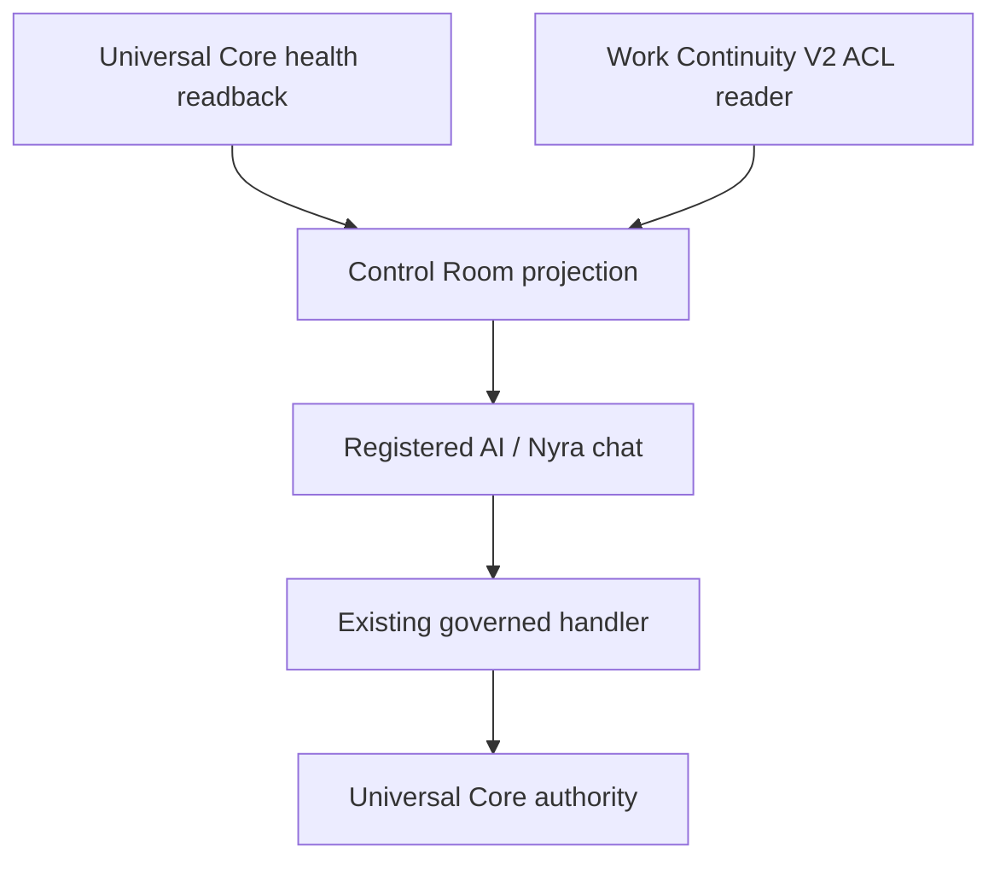

# Nyra Control Room v1

## Flusso

`P` non invoca automaticamente `C`. Lo rende soltanto esplicito quando esiste
un percorso implementato. Una AI può usare lo stesso contratto sia come host
Nyra conversazionale sia come host capability-bound; tenant, app identity e
Work ACL sono sempre derivati dal server.

## Uso in chat

Il renderer/chat può tradurre richieste naturali quali:

- “Nyra, mostrami i controlli disponibili”;
- “Nyra, stato Entity 360 e Semantic Guard”;
- “Nyra, fammi vedere la continuità del Work `<uuid>`”.

nel tool read-only `nyra_control_room_status`. Non deve inventare percentuali,
stati o azioni non presenti nell'output. Per un'azione l'AI deve seguire il
campo `allowed_actions`: se è `REQUEST_ONLY` o `DEPLOYMENT_CONFIGURATION`,
spiega il prerequisito e non dichiara che il cambiamento sia avvenuto.

## Domini iniziali

| Dominio | Stato letto da | Azione reale/limite |
| --- | --- | --- |
| Nyra Dialogue | configurazione MCP | change di deploy, riavvio richiesto |
| Entity 360 | Core `/healthz` | solo richiesta governata `entity_360_shadow_enable` |
| Semantic Scope Guard | Host Native governance | change di deploy, riavvio richiesto |
| Work Continuity | Core health + V2 Work | lettura Work/closure, nessuna mutazione |
| Research Airlock | Core health | stato globale, workflow per-Work separato |
| Policy Registry | Core health | lifecycle esistente, Core/owner governati |

## Percentuale Work

La percentuale è intenzionalmente conservativa. La chiusura verificata pesa un
gate separato: task ed evidence completati non autorizzano a dire che un Work
è chiuso. Un record legacy o una projection corrotta produce un blocker
`server_work_context_invalid` e `percent=null`, non una stima.

## Sicurezza e prestazioni

- `nyra_control_room_status` è esente dal generic preflight e può partire
  senza sessione MCP; evita il doppio giro che rendeva Nyra lenta/ripetitiva.
- Con `work_id` esatto usa un solo reader V2 tenant-ACL'd e non una pipeline
  di reasoning/preflight.
- Non restituisce task/evidence raw, tenant input o authority material.
- Una denial ACL resta una denial: non diventa `0%` né Work inesistente.
- Con Dialogue ON il tool rimane visibile nel front-door perché deve poter
  dichiarare anche che Dialogue è ON/OFF senza ricorrere a un secondo modello.
