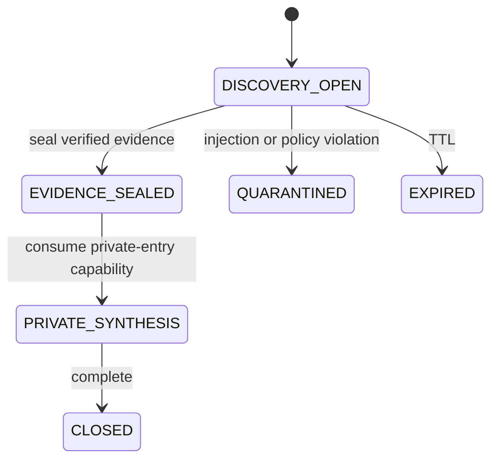

# Nyra/Core Research Airlock v1

Status: production overlay `enforced` for tenant-bound Nyra/Core research flows.

## Problem and boundary

Web evidence is untrusted data. If one model sees both public pages and private
tenant context, an indirect prompt injection can try to turn source text into
instructions and exfiltrate private values. Research Airlock separates those
trust domains and makes Nyra/Core network capabilities state-dependent.

The guarantee is deliberately bounded: after private entry, no external access
is allowed through Nyra/Core tools. ChatGPT Browse, Deep Research, or other host
tools outside this connector are not intercepted and must not be described as
covered by this implementation.

## Trust domains and state machine

The first Nyra/Core work action in a fresh logical session must be
`nyra_research_airlock_plan`. Core validates the exact public URLs, computes the
plan digest and issues a short-lived, single-use plan capability. The caller
cannot claim the plan digest. `nyra_research_airlock_open` consumes that
capability atomically with work creation.

Before a work exists, Core keeps a durable session guard. Any private-data read
or unclassified Nyra/Core tool may complete for its original purpose but marks
the session `PREOPEN_TAINTED`; plan issuance and opening are then permanently
denied for that session. This closes the read-private-then-open-public sequence,
including URLs used as an outbound data carrier. Work lookup and the pre-open
decision run under the same session advisory lock used by plan consumption, so
a concurrent open cannot create a stale authorization window.



- `DISCOVERY_OPEN`: public-only. Only the dedicated server-side HTTPS fetch is
  allowed; private tenant content is not accepted.
- `EVIDENCE_SEALED`: evidence digest and signed capsule are immutable. Public
  discovery is closed.
- `PRIVATE_SYNTHESIS`: sanitized typed spans may be combined with private
  context; all Nyra/Core web/research egress is denied.
- TTL expiry is persisted as `EXPIRED` with an audit event from every active
  state; it never silently re-opens egress.
- terminal states never transition backwards. A replan uses a new work ID and
  a new logical session so previously seen private context cannot inherit a new
  public channel.

## Server-side discovery

The model supplies only one of the exact HTTPS URLs immutably registered in the
Core-issued public plan. Path or query changes are denied, so source text
cannot turn a later discovery call into a URL-based exfiltration sink.
Universal Core:

1. issues a single-use `DISCOVERY_FETCH` capability;
2. resolves DNS and rejects private, loopback, link-local, documentation,
   multicast and reserved addresses, including IPv4-mapped IPv6 and both
   well-known NAT64 translation prefixes;
3. connects to a validated numeric address while preserving TLS SNI and hostname
   verification, preventing DNS rebinding between validation and connect;
4. permits HTTPS/443 `GET` or `HEAD` only, no cookies, auth headers, request
   body, JavaScript or service workers;
5. revalidates every redirect against DNS/IP and the original domain allowlist;
6. bounds time, bytes, redirects and content type;
7. scans raw bytes inside Core, strips active content and returns only typed,
   non-executable spans plus signed digests. Raw bytes are neither returned to
   the model nor persisted.

## Durable reference monitor

PostgreSQL tables `research_airlock_session_guard`, `research_airlock_plan`,
`research_airlock_work`, `research_airlock_capability`, `research_airlock_fetch`
and `research_airlock_event` hold pre-open taint, Core-owned plans, FSM state,
single-use nonces, fetch proof and audit metadata. Plan consumption and work
creation are one transaction. Sealing and issuance of the single private-entry
capability are also one transaction. Session guarding, state transitions, TTL
expiry, nonce consumption and audit use transactions plus advisory locks. A
tenant/session uniqueness constraint prevents a terminal session from being
reused for a fresh public work. Production has no memory fallback.

Core MCP binds the work session to the server-issued agent-presence session.
Before every tool call in the logical session, it asks Core for the current
session state and supplies a classification derived from the server-owned tool
catalog. The public phase allows only Airlock discovery/sealing controls and
therefore cannot read tenant workspaces. The private phase denies all
open-world tools and all unknown dynamic capabilities. Generic web
compatibility, Deep V2 and legacy research ingestion cannot bypass the FSM.
All Airlock controls are exempt from the generic work preflight so that a
preflight cannot read tenant memory before the public-only plan is opened.

The boundary starts at the Nyra/Core reference monitor. Text already present in
the host conversation before the first connector call, and native ChatGPT host
tools, are outside this guarantee; use a fresh logical session and do not place
private values in a public source URL.

## Enforcement overlay

Only this overlay is promoted:

```json
{
  "enforcement_scope": "research_airlock_v1",
  "enforced_branch_ids": {
    "core": ["research_evidence_intelligence"],
    "nyra": ["research_evidence"]
  }
}
```

The branches remain advisory for all unrelated behavior. No execution authority,
OAuth scope, tenant entitlement, provider execution or global policy mode is
expanded.

## Rollback

Set `CORE_RESEARCH_AIRLOCK_MODE=shadow`. New Airlock work then fails closed and
the immutable PostgreSQL audit remains readable. Use a forward revert on `main`
for code rollback; never force-push or delete evidence/audit rows.
